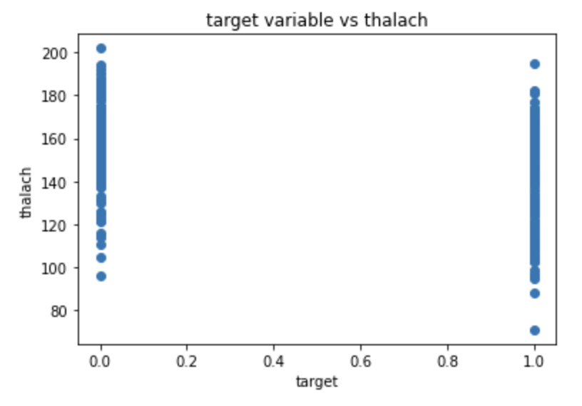
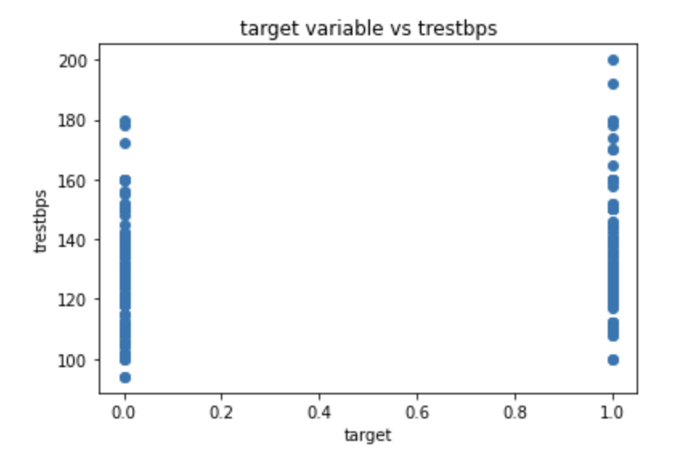
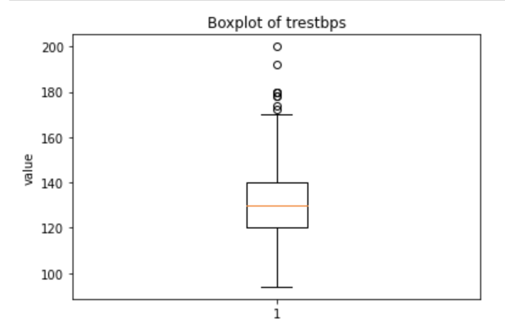

# MachineLearning_Final

## Dataset

The dataset used in this project is based on heart disease from Kaggle (https://www.kaggle.com/datasets/ritwikb3/heart-disease-statlog). There are 270 entries in the dataset. There are 13 attributes in this data set with one target variable. The target variable is labeled with either '0' no heart disease or '1' heart disease is detected. 

The 13 attributes are the following:

Age - Patient age in years

Sex - Gender of the Patient (Male: 1, Female: 0)

cp - type of chest pain experienced (0 : typical angina, 1 : atypical angina, 2 : non - anginal pain, 3: asymptomatic)

trestbps - patient's level of blood pressure at rest. 

chol - serum cholestrol

fbs - blood sugar lebels on fasting.

restecg - result of electrocardiogram while at rest (0: Normal, 1: having ST-T wave abnormality)

thalach- Max heart rate achieved.

exang - Angina induced by exercise (0 : no, 1: yes)

oldpeak - exercise induced ST-depression in relative with state of rest

slope - ST segment measured in terms of slope during peak exercise.

ca - number of major blood vessels

thal - a blood disorder valled thalassmia

Questions to answer about dataset:

Is the dataset balanced?
The target variable labeled with 1 has 120 entries.
The target variable labeled with 0 has 150 entries.

I would consider this dataset to be relatively balanced. There is not an overwhelming amount of either 0 or 1. 

Any correlation between features?

There looks to be a small correlation between the target variable and thalach. It looks like more people who have a lower thalach level are diagnosed with heart disease. 

It looks like there is a small correlation between the target variable and trestbps. The higher the trestbps, the more likely there is heart disease detected.

Are there any outliers?

Looking at this boxplot, there seems to be quite a few outliers for the attribute trestbps. This could cause an issue in our machine learning model predictions, but we will leave them in the dataset for now. 

I do not believe that there needs to be any feature engineering necessary for this dataset, all of the features have numerical outputs.

## Models

The three models used in this analysis are Logistic Regression, Support Vector Classifier, and Random Forests. Below are the results without hyperparameter tuning.

| Model              | Test Accuracy Score | Train Accuracy Score | ROC AUC Score |
| ------------------ | ------------------- | -------------------- | ------------- |
| Logistic Regression| 0.86                | 0.84                 | 0.85          |
| SVC                | 0.70                | 0.63                 | 0.67          |
| Random Forest      | 0.85                | 1.0                  | 0.84          |

The logisitc regression model looks like the most promising model for predicting whether someone has heart disease or not. The test accuracy is 0.86 and the train accuracy is 0.84. The ROC AUC score tells us how efficient the model is and tells us how well the model's performance is at distinguishing between the positive and negative classes. A score of 0.85 is a good baseline for this. There is always room for improvement. 
The SVC results are not as good as the logistic regression results. The test accuracy is 0.70 and the train accuracy is 0.63. It is interesting that the model accuracy for the train data is lower than the test. The ROC AUC Score is also low, this means that the model did not predict the positive and negative classes as well as the other models. Again, there is always room for improvement with hyperparameter tuning. 
The Random Forest test accuracy is 0.85 and the train accuracy is 1.0. A model that predicts the train data 100 percent correct is overfit. This model should have had a higher accuracy score for the test data if it can accurately predict 100 percent of the training data. After hyperparamter tuning these accuracies could change. 

## Baseline Performance

Hyperparameter tuning is needed to fine tune these models and adjust the accuracies. Grid search will be utilized to see which combination of parameters produce the best model performance. 

Parameters adjusted for Logistic Regression:
solver, penalty, and C

Parameters adjusted for Support Vector Machines:
C and gamma.

Parameters to be adjusted for RandomForestClassifier:
n_estimators, max_depth, min_samples_split 

After the grid search, the best hyperparameters for each of the models were the followings:
Logistic Regression:
C = 0.1, penalty = l2, random_state = 0, solver = newton-cg

Support Vector Machine Classifier:
C = 1, gamma = 0.001

Random Forest Classifier:
max_depth = 5, min_samples_split = 15, n_estimators = 300, random_state = 0

The following table shows the test and train accuracy scores as well as the test roc auc score on the test data. 

| Model              | Test Accuracy Score | Train Accuracy Score | ROC AUC Score |
| ------------------ | ------------------- | -------------------- | ------------- |
| Logistic Regression| 0.87                | 0.86                 | 0.89          |
| SVC                | 0.70                | 0.77                 | 0.69          |
| Random Forest      | 0.88                | 0.92                 | 0.88          |

After looking at the results, it looks like that logistic regression may be the best model because there is no signs of over fitting like in the Random Forest Model. The Random Forest Model still has a high training accuracy score, which means it still could be overfitting. The ROC AUC score that was the highest of all the models is the Logistic Regression model with a score of 0.89. There is still always room for more improvement with machine learning models. 

## Feature Experiments

### Experiment 1: Scaling the features

The way these features were scaled were f0+2, f1 * 2, f3 ** 2, f4 + 3, f4 * 3, f5 ** 3, ... pattern of i+, *i **i for i =2, then the model was retrained and reevaluated.

### Experiment 2: Adding New Features. 

This experiment consisted of using the puly function from sklearn to create new features.

### Experiment 3: Transform Features.

This experiement consisted of transforming the features using a PCA model. 

### Experiment 4: Preprocessing Features
This experiement used sklearn's StandardScaler to preprocess the features.

### Experiment 5: Noisy Indicators
Random features were added to see how the model predicts the target variables with these random features.

### Results
Accuracy Scores of models with the different experiments

| Model              | Experiment 1 | Experiment 2 | Experiment 3 | Experiment 4 | Experiment 5 |
| ------------------ | ------------ | ------------ | ------------ | ------------ | ------------ |
| Logistic Regression|  0.71        | 0.56         | 0.62         | 0.81         | 0.71         |
| SVC                |  0.62        | 0.62         | 0.62         | 0.62         | 0.62         |
| Random Forest      |  0.86        | 0.84         | 0.65         | 0.85         | 0.84         |

Experiment 1: The best model when using the features in experiment 1 is logistic regression. Although random forest has a higher accuracy score, the model was overfit since it predicted the train data too well with an accuracy of 100 percent. 

Experiment 2: The best model when using the features in experiment 2 was support vector machines. The accuracy score for the logistic regression was lower than support vector machines. The random forest model was overfit in this experiment as well. 

Experiment 3: The best model when completing experiment 3 was logistic regression and support vector machines, their accuracy scores were the same. The random forest model was again overfit.

Experiment 4: The best model when completing experiment 4 was logistic regression. This model had the highest accuracy score and was not overfit. Random forest model was overfit in this experiment as well. 

Experiment 5: The best model when completing experiment 5 was logistic regression. The model had the highest accuracy score and was not overfit. The random forest model was again overfit. Support vector classifier's accuracy was not quite as high as the logistic regression accuracy score. 

## Recommended Model

The recommended model after all the experiments is Logistic Regression after hyperparameter tuning. This model predicted whether someone has heart disease or not the most accurate. This model had the highest accuracy scores and logistic regression did the best when completing the different feature experiments as well. A pipeline has been created for this model. 
